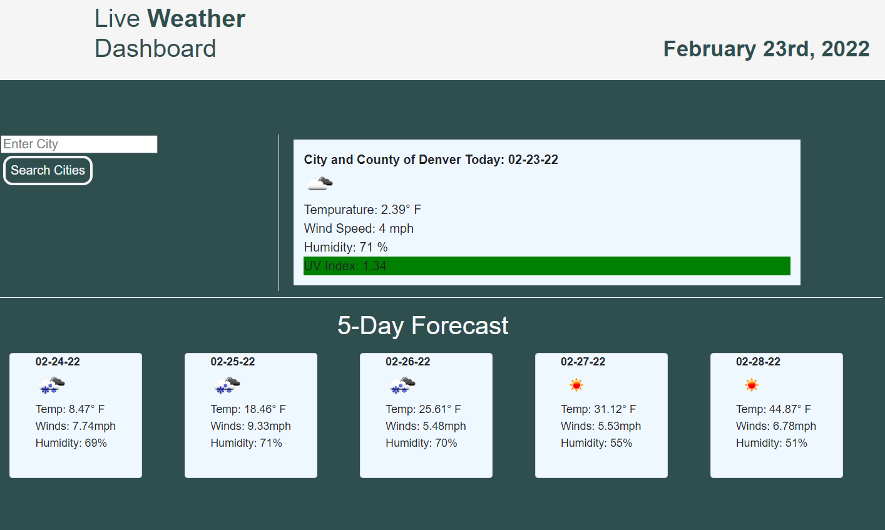
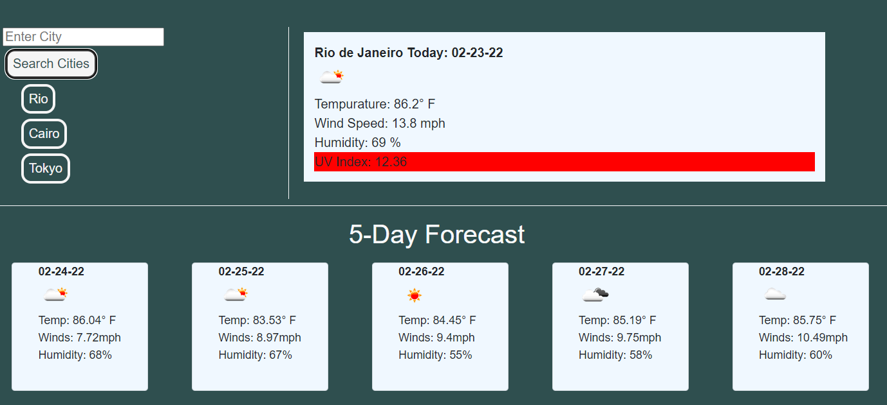

# Live-Weather-Dashboard

## link: https://eeoerkeedu.github.io/Live-Weather-Dashboard/

## Description

A helpful weather forecast tool for any travelers looking to know more about their destination and prepare accordingly. Utilizes Open Weather Map API.

## Usage

Enter a vaild city name into the search field and it will present you with the current weather for that location as well as a 5-day forecast.

Click on the search history buttons and you'll be shown theweather for that location again.

On page load the page presents the last searched location from the previous session, or Denver, CO if there is no local data.

## Screenshots

## 

## 

## Credits

Heavily utilizes the Open Weather Map API for weather and city data
link: https://openweathermap.org/

## Features

Retains Search History up to 5 instances, displays 5-day forecast as well as current weather.

## Tests

Issues arrise when an invaild city name is entered, still debugging this part.
